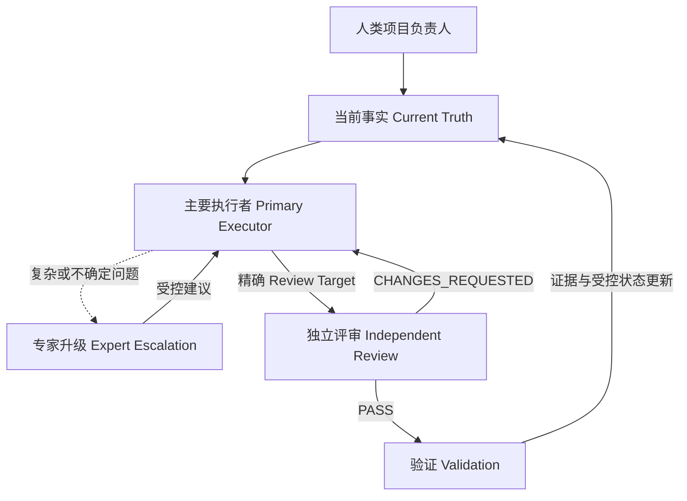

# AI 软件工程治理框架

面向长周期 AI 软件开发的模型无关工程治理框架。

> **AI Agent 擅长连续工作数小时，而软件项目往往持续数月。**

本仓库**不是提示词合集**，而是一套可复用、与 Harness 无关的工程控制体系。当多个 AI Agent 与人类在长周期内协作时，它用于保持需求、决策、实现、评审、测试和项目状态的一致性。

本框架通过受治理的执行路径，解决需求漂移、过期决策、上下文丢失、Agent 冲突、完成状态不可验证、模型替换以及长期项目连续性问题：

```text
当前事实（Current Truth）
↓
主要执行者（Primary Executor）
↓
专家升级（Expert Escalation）
↓
独立评审（Independent Review）
↓
验证 / 发布（Verification / Release）
```

用户和 Agent **不需要**为每项任务读取所有模板文件，只需按照 `AI_START_HERE.md` 的路由加载与任务相关的 Current Truth 和工程产物。

当前已发布基线：**v0.1.3**

## 为什么需要这个框架

AI 编码 Agent 在单项任务中表现出色，但长周期项目通常会以一些可预见的方式失控：

- 聊天历史逐渐成为不可靠的事实来源；
- 同一状态被复制到多个文件并产生漂移；
- 替换后的模型重新打开已经确定的决策；
- 实现 Agent 评审或关闭自己的工作；
- 测试看似完整，却缺少从需求到证据的追溯；
- 旧项目将当前行为与过时意图混在一起；
- 常规技术决策频繁打断人类，而真正需要权威裁决的事项反而绕过了人类。

本框架把这些失效模式转化为明确的事实所有权、工作路由、独立评审和证据规则。

## 核心概念

| 问题 | 治理机制 |
|---|---|
| 项目事实冲突或过期 | **当前事实（Current Truth）** |
| 状态在多个文档中重复维护 | **一个事实，一个所有者（One Fact, One Owner）** |
| 模型或 Harness 被替换 | **基线重学（Baseline Relearn）** |
| 角色与特定运行环境或工具绑定 | **Role != Model != Harness != Tool** |
| 常规工作与高级判断混在一起 | **专家升级（Expert Escalation）**与**多模型工作流（Multi-model Workflow）** |
| 自我评审和自我批准 | **独立 C04 评审（Independent C04 Review）** |
| 声称已覆盖却没有证据链接 | **需求 → 架构 → 设计 → 代码 → 测试追溯** |
| 已有代码但文档不完整 | **旧项目迁移（Brownfield Migration）** |
| 自动化缺少明确授权边界 | **SUPERVISED_AUTO / FULL_AUTO** |
| 数月协作造成上下文漂移 | **长周期 AI 软件开发治理** |

## 架构



稳定规则是 `Role != Model != Harness != Tool`。角色定义权限、责任与 Gate 身份；模型提供推理能力；Harness 提供 Agent 执行环境；工具、CLI 和 API 是可调用机制。调用某个工具或模型，不会自动获得通常与其关联的治理角色或批准权限。

## 五分钟开始使用

1. 选择 [Full 或 Lite 采用方式](docs/FULL_VS_LITE.md)。
2. 将选定模板复制或解压到新项目或已有项目中。
3. 要求主要 Agent 依次读取 `AI_START_HERE.md`、`AI_ENGINEERING_RULES_V2.md`、`AI_CONVERSATION_ORCHESTRATION_RULES.md` 和 `00_project/ai_context/CURRENT_STATE.md`。
4. 替换项目占位符，并在 `CURRENT_STATE.md` 中设置当前授权和 Model/Harness 路由。
5. 新项目从 C00/C01 开始；已有项目从旧项目只读盘点流程开始。

完整顺序见[快速开始](docs/QUICK_START.md)。

## Full Template 与 Lite

| 采用方式 | 适用场景 | 包含的治理能力 |
|---|---|---|
| **Full Template** | 长周期、受监管、多学科、高风险或旧项目系统 | 完整 C00～C06 工作流、V 模型产物、追溯、评审、测试治理、迁移、发布和运维结构 |
| **Lite** | 小团队、试点、低风险应用或框架评估 | 保留核心 Current Truth、事实所有权、角色路由、上下文重置、任务状态和独立评审文件，无需一开始采用完整目录树 |

Lite 是一种采用方式，不是第二套治理事实来源。项目可以从 Lite 开始，并在风险上升或周期变长时增加 Full Template 控制。

## 支持的 Agent

本框架与模型和 Harness 无关。只要编码 Agent 能读取项目文件、维护 Git 感知的上下文并遵守明确的角色边界，就可以使用本框架，例如 Codex、OpenCode 等。

示例路由：

| 职责 | Model | Harness |
|---|---|---|
| 主要执行者 | DeepSeek（例如 V4 Flash High） | OpenCode |
| 专家 / 独立评审者 | GPT-5.6 Sol | Codex |
| 后备专家 / 评审者 | Kimi | OpenCode |

这些组合只是示例，不是强制要求。用户可以替换任意模型、Harness 或服务商，而不改变工程角色、治理边界或 Current Truth。

## 仓库结构

- `AI_START_HERE.md` — Agent 必读入口。
- `AI_ENGINEERING_RULES_V2.md` — 稳定的工程治理规则。
- `AI_CONVERSATION_ORCHESTRATION_RULES.md` — 上下文、会话和交接治理规则。
- `00_project/ai_context/` — 当前状态、Baseline、决策、任务、问题和角色简报。
- `01_product_requirements/` 至 `15_operations/` — 完整 Full Template 生命周期结构。
- `09_quality/traceability/` — 机械化追溯校验。
- `docs/` — 采用与使用指南。

## 贡献与安全

提交修改前请阅读[贡献指南](CONTRIBUTING.md)。安全问题请按[安全政策](SECURITY.md)私下报告；不要在公开 Issue 中提交凭据、客户数据、私有项目事实或内部基础设施信息。

## 许可证

本项目采用 [Apache License 2.0](LICENSE) 许可证。

第三方产品名称和商标仅用于识别和互操作。所有商标均归其各自所有者所有，本项目与这些厂商不存在隶属关系，也未获得其背书。
