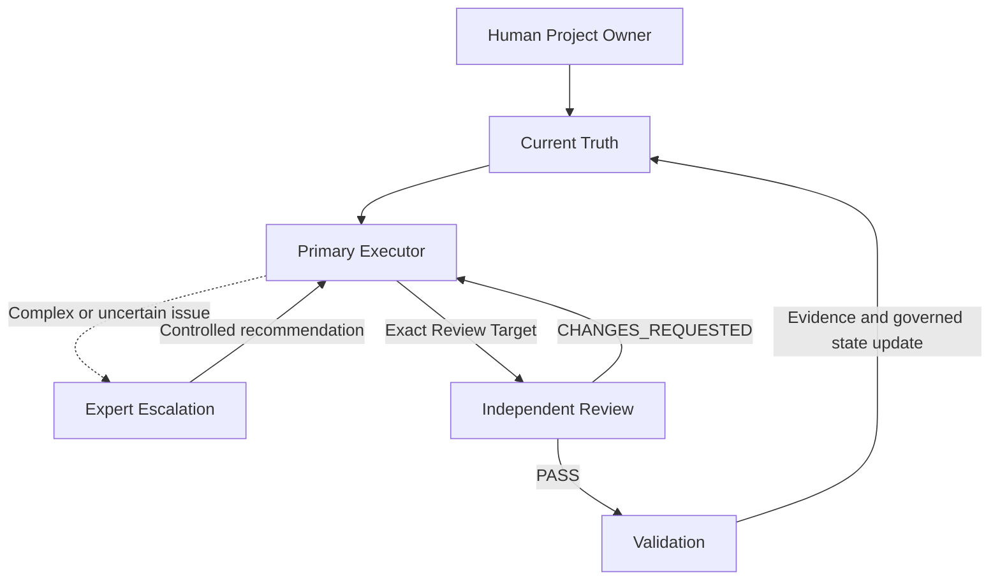

# AI Software Engineering Governance Framework

## AI 软件工程治理框架

面向长周期 AI 软件开发的模型无关工程治理框架。

A model-agnostic governance framework for long-running AI software projects.

> **AI agents are great for hours. Software projects last months.**

This repository is **not a prompt collection**. It is a reusable, harness-agnostic engineering control system for keeping requirements, decisions, implementation, review, testing, and project state coherent while multiple AI agents and humans work across long timelines.

It addresses requirement drift, stale decisions, context loss, conflicting agents, unverifiable completion, model replacement, and long-running project continuity through a governed execution path:

```text
Current Truth
↓
Primary Executor
↓
Expert Escalation
↓
Independent Review
↓
Verification / Release
```

Users and agents do **not** need to read every template file for every task. Load only the task-relevant Current Truth and engineering artifacts routed by `AI_START_HERE.md`.

Status: **v0.1.0 Release Candidate**

## Why this framework exists

AI coding agents are effective within a task, but long-running projects fail in predictable ways:

- chat history becomes an unreliable source of truth;
- the same state is copied into several files and drifts;
- a replacement model reopens settled decisions;
- implementation agents review or close their own work;
- tests appear complete without requirement-to-evidence traceability;
- brownfield projects mix current behavior with obsolete intent;
- humans are interrupted for routine technical decisions but bypassed for real authority decisions.

This framework turns those failure modes into explicit ownership, routing, review, and evidence rules.

## Core concepts

| Problem | Governance mechanism |
|---|---|
| Conflicting or stale project facts | **Current Truth** |
| Duplicated state across documents | **One Fact, One Owner** |
| Model or harness replacement | **Baseline Relearn** |
| Roles coupled to a specific runtime | **Role != Model != Harness** |
| Routine work mixed with advanced judgment | **Expert Escalation** and **Multi-model Workflow** |
| Self-review and self-approval | **Independent C04 Review** |
| Claimed coverage without evidence links | **Requirements → Architecture → Design → Code → Test Traceability** |
| Existing code with incomplete documentation | **Brownfield Migration** |
| Automation without bounded authority | **SUPERVISED_AUTO / FULL_AUTO** |
| Context drift over months of work | **Long-running AI Software Development Governance** |

## Architecture



The stable rule is `Role != Model != Harness`. Roles define authority and responsibility; models and harnesses are replaceable runtime configuration.

## Start in five minutes

1. Choose the [Full or Lite adoption profile](docs/FULL_VS_LITE.md).
2. Copy or extract the selected template into a new or existing project.
3. Ask the primary agent to read `AI_START_HERE.md`, `AI_ENGINEERING_RULES_V2.md`, `AI_CONVERSATION_ORCHESTRATION_RULES.md`, and `00_project/ai_context/CURRENT_STATE.md`.
4. Replace project placeholders and set the current authorization/model routing in `CURRENT_STATE.md`.
5. Start with C00/C01 for a new project, or the brownfield inventory flow for an existing project.

See the [Quick Start](docs/QUICK_START.md) for the exact sequence.

## Full Template vs Lite

| Profile | Best for | Included governance |
|---|---|---|
| **Full Template** | Long-running, regulated, multidisciplinary, high-risk, or brownfield systems | Complete C00-C06 workflow, V-model artifacts, traceability, reviews, test governance, migration, release, and operations structure |
| **Lite** | Small teams, pilots, low-risk applications, or framework evaluation | Core Current Truth, fact ownership, role routing, context reset, task state, and independent review files without adopting the full directory tree |

Lite is an adoption profile, not a second source of governance truth. Projects can begin Lite and add Full Template controls when risk or project duration increases.

## Supported agents

The framework is model- and harness-agnostic. It can be used with Codex, OpenCode, and other coding agents that can read project files, maintain Git-aware context, and follow explicit role boundaries.

Example routing:

| Responsibility | Model | Harness |
|---|---|---|
| Primary Executor | DeepSeek (for example, V4 Flash High) | OpenCode |
| Expert / Independent Reviewer | GPT-5.6 Sol | Codex |
| Fallback Expert / Reviewer | Kimi | OpenCode |

These combinations are examples, not requirements. Users may replace any model, harness, or provider without changing the engineering role, governance boundaries, or Current Truth.

## Repository map

- `AI_START_HERE.md` — mandatory agent entry point.
- `AI_ENGINEERING_RULES_V2.md` — stable engineering governance.
- `AI_CONVERSATION_ORCHESTRATION_RULES.md` — context, session, and handoff governance.
- `00_project/ai_context/` — current state, baselines, decisions, tasks, questions, and role briefs.
- `01_product_requirements/` through `15_operations/` — complete Full Template lifecycle.
- `09_quality/traceability/` — mechanical traceability validation.
- `docs/` — adoption and usage guidance.

## Contributing and security

Read [CONTRIBUTING.md](CONTRIBUTING.md) before proposing changes. Report security issues according to [SECURITY.md](SECURITY.md); do not place credentials, customer data, private project facts, or internal infrastructure details in public issues.

## License

Licensed under the [Apache License 2.0](LICENSE).

Third-party product names and trademarks are used only for identification and interoperability purposes. All trademarks belong to their respective owners. This project is not affiliated with or endorsed by those vendors.
